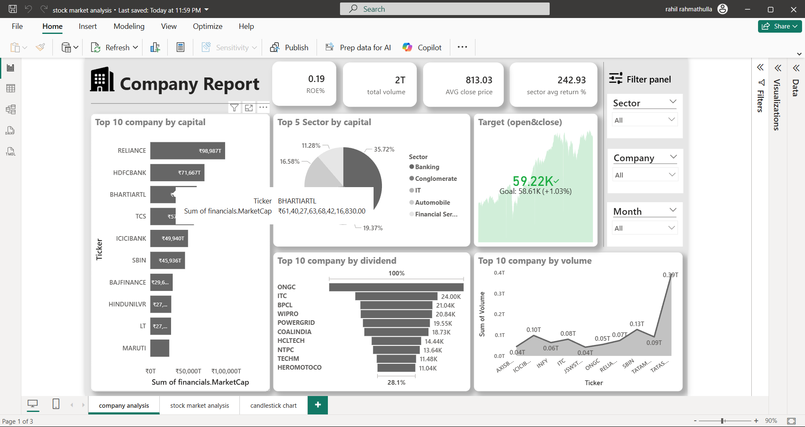
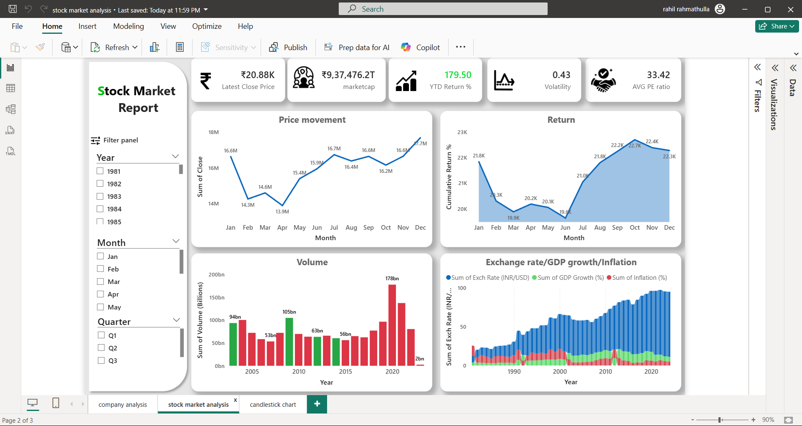
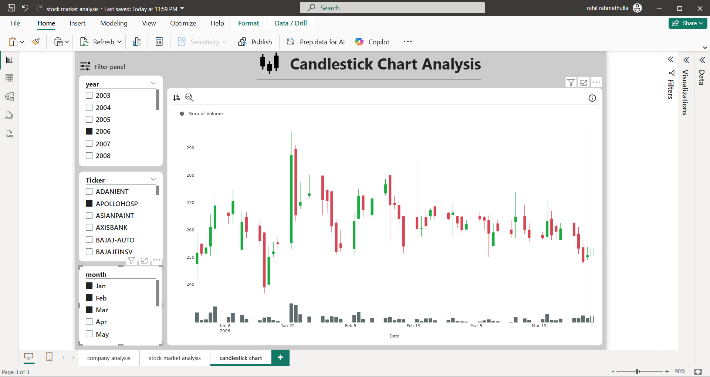
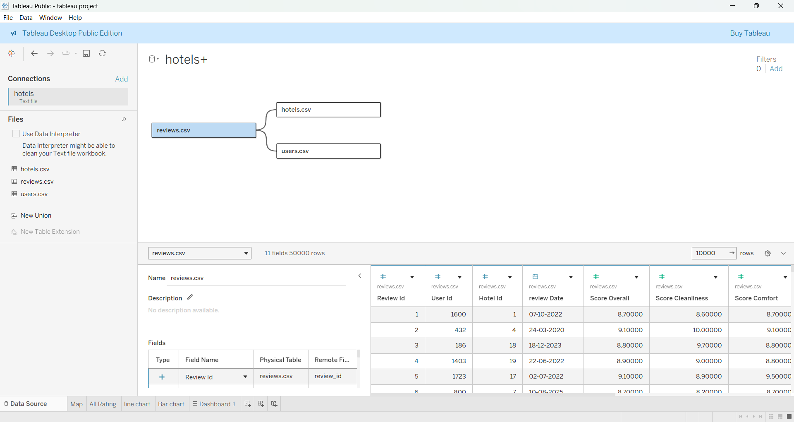

# 📊 Data Analyst & Business Analyst Portfolio

## 👋 About Me
Data Analyst and Business Analyst with practical experience in **Power BI, Excel, SQL, Python, and Tableau**, specializing in **business performance analysis and dashboard-driven insights**. Adept at converting complex datasets into clear KPIs and visual reports that support management decisions, operational efficiency, and strategic planning.

---

## 🛠 Core Skills

### Analytics & BI Tools
- Power BI (DAX, KPI Dashboards, Data Modeling)
- Microsoft Excel (Power Query, Pivot Tables, Interactive Dashboards)
- Tableau (Business Reporting & Visualization)
- SQL (MySQL – Data Extraction & Analysis)

### Data & Business Analysis
- Data Cleaning & Transformation
- Exploratory Data Analysis (EDA)
- KPI Design & Performance Tracking
- Trend, Variance & Comparative Analysis
- Business Insight & Decision Support

### Programming & ML (Applied)
- Python (Pandas, NumPy, Matplotlib, Seaborn)
- Machine Learning: Linear Regression, Decision Tree, Random Forest, XGBoost
- Model Evaluation & Interpretation

---

## 💼 Industry Experience

### Data Analyst Intern  
**Techolas Technologies Pvt. Ltd**

- Analyzed structured datasets using **SQL, Excel, and Python** to identify trends and performance gaps.
- Designed **interactive dashboards** in Tableau to support business reporting and operational reviews.
- Improved data quality through structured cleaning and preprocessing workflows.
- Worked closely with team members to translate analytical results into **business-friendly insights**.

---

## 📂 Selected Projects

### 📈 Stock Market Performance Dashboard (Power BI)
**Business Goal:**  
Provide investors and analysts with a clear view of stock trends, risk indicators, and market performance.

**Key Work:**  
- Defined financial KPIs such as **Market Capitalization, PE Ratio, Volatility, and YTD Return**
- Webscraped data from websites for real time stock data
- Built time-series and comparative visuals for trend analysis
- Applied conditional formatting to highlight performance signals

**Business Impact:**  
- Simplified complex financial data into actionable insights  
- Enabled quick comparison across stocks and time periods

### Dashboard

#### Company-Level Analysis

#### Market-Level Analysis

#### Candlestick Chart

---

### 🛒 Retail Sales & Performance Analysis (Excel)
**Business Goal:**  
Evaluate sales performance and profitability to support retail decision-making.

**Key Work:**  
- Automated data cleaning using **Power Query**
- Built KPI-driven Excel dashboard with slicers
- Analyzed category-wise and time-based sales trends

**Business Impact:**  
- Identified high-revenue products and categories  
- Highlighted seasonal patterns affecting sales

### Dashboard

---

### 🤖 Predictive Analytics: Suicide Rate Prediction (ML)
**Business Goal:**  
Use predictive modeling to understand patterns in social data and forecast outcomes.

**Key Work:**  
- Performed EDA and feature preparation using Python
- Built and compared multiple regression models
- Selected best model based on evaluation metrics
- Deployed a real-time prediction app using **Streamlit**

**Business Impact:**  
- Demonstrated practical use of ML for real-world decision support  
- Translated model outputs into interpretable insights
  
---

### ⭐ Hotel Review Analytics Dashboard (Tableau) 

**Business Goal:**
Enable hospitality stakeholders to evaluate customer satisfaction by analyzing hotel reviews across multiple quality dimensions and demographics.

**Key Work:**

-Designed interactive dashboards to analyze Overall Rating, Cleanliness, Comfort, Facilities, Staff, Location, and Value for Money
-Built a dynamic metric selector (parameter) to switch between different review KPIs
-Created time-series trend analysis to track rating consistency over months and years
-Developed geographical analysis using maps to compare average ratings by country
-Implemented advanced filters for traveler type, age group, hotel, city, and date
-Modeled and integrated multiple datasets (Hotels, Users, Reviews) in Tableau

**Business Impact:**

-Helped identify top-performing and underperforming hotels based on customer feedback
-Revealed how traveler type and demographics influence hotel ratings
-Enabled data-driven decisions to improve service quality and customer experience

### Dashboard

---

### 🎯 Business KPI & Target Tracking Dashboard
**Business Goal:**  
Monitor organizational performance against defined targets.

**Key Work:**  
- Designed KPIs for **Target vs Actual**, Growth %, and Trends
- Built executive-level visuals for quick performance evaluation

**Business Impact:**  
- Improved visibility into underperforming areas  
- Supported management review meetings  

---

## 🎓 Education
**Bachelor of Business Administration (B.B.A)**  
Focus on analytics, business metrics, and decision-making.
*CGPA : 8.125*

**Commerce with Computer Application**
Focus on Financial and computer knowledge
*Percentage : 95.5%*

---

## 📫 Contact
- **Email:** rahilrahma2004@gmail.com  
- **LinkedIn:** https://www.linkedin.com/in/rahil-rahmathulla-524231348  
- **GitHub:**  
  - https://github.com/rahilrahma/projects-excel-BI.git (excel)  
  - https://github.com/rahilrahma/python-project.git (python)
  - https://github.com/rahilrahma/project-powerbi.git (power bi)
  - https://github.com/rahilrahma/Tableau-project.git (tableau)

---

⭐ *Actively seeking Data Analyst and Business Analyst opportunities.*
